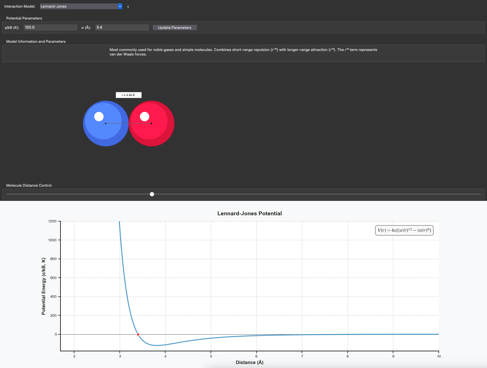

# pyPairViz-Streamlit

An interactive visualization tool for exploring molecular interaction potentials, built with Streamlit. This application provides a web-based interface to visualize and understand different molecular potential models commonly used in physics and chemistry.



## Features

- Interactive visualization of various molecular potential models:
  - Lennard-Jones Potential
  - Hard Sphere Model
  - Square Well Potential 
  - Sutherland Potential
  - Morse Potential
  - Buckingham Potential
  - Yukawa Potential
  - Mie Potential

- Real-time visualization of:
  - Potential energy curves
  - Molecular distance relationships
  - Interactive particle visualization

- Adjustable parameters for each potential model:
  - Energy parameter (ε/kB)
  - Distance parameter (σ)
  - Model-specific parameters

## Installation

1. Clone this repository:
```bash
git clone https://github.com/[your-username]/pypairviz-streamlit
cd pypairviz-streamlit
```
2. Install requirements:
```bash
pip install -r requirements.txt
```
3. Run the application:
```bash
streamlit run pypairviz_app.py
```

## Usage
    1. Select a potential model from the sidebar dropdown menu
    2. Adjust the model parameters in the sidebar
    3. Use the distance slider to change the separation between molecules
    4. Observe the real-time updates in both the molecule visualization and potential energy plot
## Requirements
    - Python 3.7+
    - Streamlit
    - NumPy
    - Matplotlib
    - Plotly
## Contributing
Contributions are welcome! Please feel free to submit pull requests, create issues, or suggest new features.

## License
This project is licensed under the MIT License - see the LICENSE file for details.

Acknowledgments
This is a Streamlit implementation of the original [pyPairViz](https://github.com/njcorrente/pyPairViz) by [Nick Corrente](https://github.com/njcorrente).